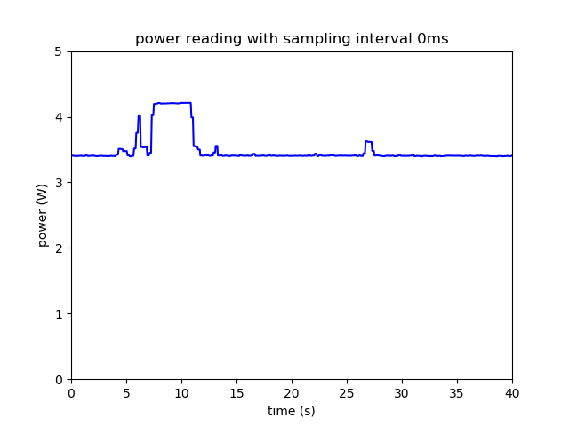
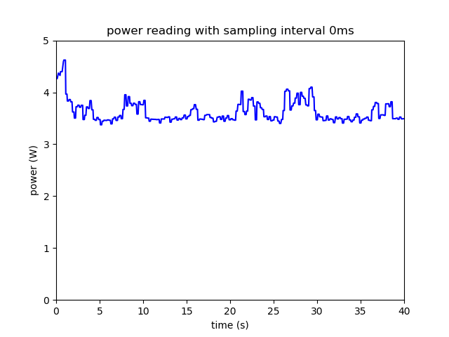

# Overhead Analysis

Report on the overhead analysis when reading power consumption from Raspberry Pi with Powermeter.

## Motivation

When we use a Raspberry Pi to run a thread, and, at the same time, use powermeter to measure the power consumption, the thread that runs the measurement may interfere the accuracy of the power reading. So we design an experiment to measure the overhead of power consumption.

## Experiment Design

- Set up Python environment on two Raspberry Pi's.
- Install UCSD-SEELab/powermeter module on one of the Pi's (measuring Pi) and connect the USB cable of the powermeter to this Pi. Plug the other Pi (target Pi) to the powermeter 
- Install RPi.GPIO on both Pi's.
- Connect two Pi's with a wire on GPIO pins.
- Connect the ground pins of two Pi's.
- Set the connected pin on the measuring Pi as INPUT and set the pin on the target Pi as OUTPUT.
- Run a simple python program on the target Pi.
- Use the measuring Pi to read the power data with demo_animation.py and demo_process.py, store the image of power reading and calculate the average power consumption on a certain time interval.
- Now disconnect two Pi's and plug the measuring Pi to the powermeter.
- Run the same python program on measuring Pi and use demo_animation.py and demo_process.py to store the image of power reading and calculate the average power consumption on the same time interval.

## Results and Analysis

Here is the power reading when running the demo code on a target Pi and measuring the power from another Pi:

(Note: the straight line at the beginning indicates that the measuring Pi is waiting for the input of target Pi)

The average power consumption is 4.21W.

And here is the power reading when running the demo code and measuring the power on the same Pi:

The average power consumption is 4.48W.

The overhead is approximately 0.27W.